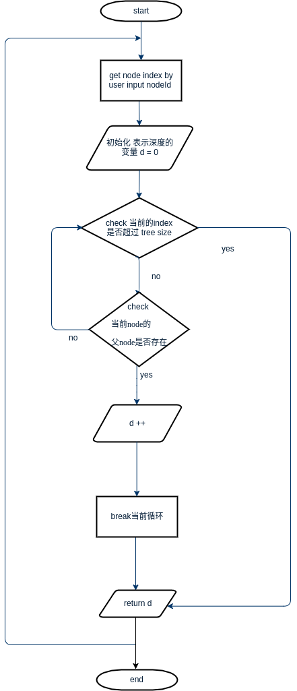

# Introduction to Homework4 of Algorithm
> Author : 大祥  
> StartTime: 2017-06-23 ，ModifyTime：2017-06-23

## Requirement
**Chap 21-2: Depth Determination**

Please implement MAKE-TREE(v), FIND-DEPTH(v), and GRAFT(r, v).

MAKE-TREE(v) creates a tree whose only node is v.

FIND-DEPTH(v) returns the depth of node v within its tree.

GRAFT(r, v) makes node r, which is assumed to be the root of a tree, become the child of node v, which is assumed to be in a different tree than r but may or may not itself be a root.

給定一串指令並依照指令M(MAKE-TREE), D(FIND-DEPTH), G(GRAFT), E(END)分別依序處理執行建樹、找深度、合併樹或結束，並在處理F(FIND-DEPTH)指令時輸出該node之DEPTH值。

輸入:  
每筆測試資料的每一行第一位數為指令(M,F,G or E)，M v表示MAKE-TREE(v) v表示node編號(node編號<=1000,指令與編號間以空白鍵隔開), F v表示FIND-DEPTH(v) v代表要輸出DEPTH值之node編號(指令與編號間以空白鍵隔開), G r v表示(GRAFT(r, v))其r值表示the root a tree而且r為the child of node v (此node v可以是root或不是)，指令G與r, r與v間以空白鍵隔開，當指令為E時表示處理指令結束(測資結束).

輸出:  
螢幕輸出。

## Test Example
input:  
M 1  
M 2  
M 3  
M 4  
M 5  
G 1 2  
G 3 2  
G 4 2  
G 5 4  
F 5  
M 6  
M 7  
G 7 6  
G 6 2  
F 6  
E

output:  
5 2  
6 1  

## Introduction to My Program code
### a.此程式所使用之邏輯、原理及語言之概要性說明。
此 program 用 C++ 语言编写。
用 struct Node{int id; int p; } 存放 node 的 data ,用 vector 来存放 trees。
1. 逻辑原理:
鉴于本次作业中只是求某个 nodeId 的 深度,而且 nodes 之间的父子关系已经确
定,而且不确定是否只有一棵树。
所以可以简化书上的 BFS 方法,
(1) 仅仅只是每次轮询当前 node 的父 node 是否存在,如果存在那么就让
深度 d 这个变量加 1;
(2) 然后继续寻找父 node 的父 node 是否存在,如果存在那么就让深度 d
这个变量加 1;
(3) 如此递归下去,一直到根结点也会加 1。所以我们一开始时候设置深
度变量 d 为 -1。

2. 关键部分代码如下:
```
// this one node depth + 1 when finding its parrent node
d = find_depth(i) + 1;
```

### b.程式內容細部說明(程式碼及其註解)及配合流程圖或虛擬
碼解說。
关键部分流程图:

